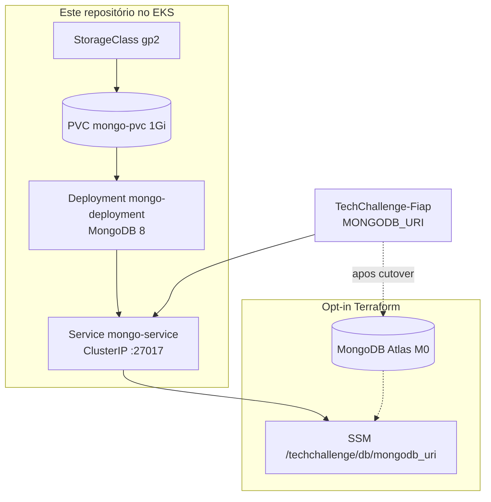

# TechChallenge-infra-db

Persistência da **oficina Node-Fiap**. O Mongo de laboratório **sobe no EKS** (Deployment + Service ClusterIP + PVC), com manifests e CD **neste** repositório.

A API no [TechChallenge-Fiap](https://github.com/RuannGodinho/TechChallenge-Fiap) só consome `mongodb://mongo-service:27017/Node-Fiap`. Atlas M0 continua opt-in via Terraform (`enable_managed_db=true`).

Este repositório entrega **somente o banco**. Cluster, API e login JWT vivem nos [repositórios irmãos](#repositórios-irmãos).

## Propósito

- Subir o MongoDB 8 no mesmo cluster da API, com volume persistente (EBS).
- Publicar `/techchallenge/db/mongodb_uri` no SSM para a API e o CD.
- Oferecer Atlas M0 como alternativa gerenciada, sem obrigar billing contínuo no laboratório.

Decisão: [RFC-002](docs/rfcs/002-mongodb-persistencia.md) / [ADR-002](docs/adrs/002-mongodb-persistencia.md). ER e coleções: [modelo de dados no Fiap](https://github.com/RuannGodinho/TechChallenge-Fiap/blob/main/docs/ARQUITETURA-MODELO-DADOS.md).

## Tecnologias

| Camada | Tecnologia |
|---|---|
| Engine (laboratório) | MongoDB 8 no EKS |
| Persistência | PVC 1 Gi + StorageClass `gp2` (EBS CSI) |
| Rede no cluster | Service ClusterIP `mongo-service:27017` |
| Opt-in gerenciado | MongoDB Atlas M0 (Terraform) |
| Config | SSM `/techchallenge/db/mongodb_uri` |
| IaC | Manifests `k8s/` + Terraform 1.11 (Atlas) |
| CI/CD | GitHub Actions (CI, CD `kubectl`, Terraform Atlas) |

## Arquitetura deste repositório

O que **este** repo sobe. A API e o EKS ficam fora.



Diagrama da solução inteira: [componentes no Fiap](https://github.com/RuannGodinho/TechChallenge-Fiap/blob/main/docs/ARQUITETURA-COMPONENTES.md).

### O que este repo sobe no cluster

| Recurso | Manifest | Função |
|---|---|---|
| StorageClass `gp2` | `k8s/mongo-storageclass.yml` | EBS CSI (só se ainda não existir) |
| PVC `mongo-pvc` | `k8s/mongo-pvc.yml` | 1 Gi persistente |
| Service `mongo-service` | `k8s/mongo-service.yml` | ClusterIP `:27017` |
| Deployment `mongo-deployment` | `k8s/mongo-deployment.yml` | MongoDB 8 |

O CD grava `/techchallenge/db/mongodb_uri` = `mongodb://mongo-service:27017/Node-Fiap`.

## Requisitos

- Cluster `techchallenge-eks` já criado no [TechChallenge-infra-eks](https://github.com/RuannGodinho/TechChallenge-infra-eks)
- `kubectl` e AWS CLI (`aws eks update-kubeconfig`)
- Para Atlas opt-in: Terraform 1.11, secrets `MONGODB_ATLAS_*` e `TF_STATE_BUCKET`

Não sobe a API nem o Gateway. O seed das coleções roda no repo da aplicação.

## Execução local

Não há Compose neste repo: o Mongo de notebook sobe no [TechChallenge-Fiap](https://github.com/RuannGodinho/TechChallenge-Fiap) (`docker compose up`).

Validar manifests e Terraform sem aplicar:

```bash
terraform fmt -check -recursive
terraform init -backend=false
terraform validate
```

Aplicar o Mongo no cluster (mesmo fluxo do CD):

```bash
aws eks update-kubeconfig --region us-east-1 --name techchallenge-eks
kubectl get storageclass gp2 || kubectl apply -f k8s/mongo-storageclass.yml
kubectl apply -f k8s/mongo-pvc.yml
kubectl apply -f k8s/mongo-service.yml
kubectl apply -f k8s/mongo-deployment.yml
kubectl rollout status deployment/mongo-deployment --timeout=180s
kubectl get svc mongo-service
```

## Deploy

Ordem ponta a ponta: **EKS (este cluster) → este repo (Mongo) → API → Lambda/Gateway**.

### Kubernetes (laboratório)

Workflow **CD** com `confirm=yes`, ou os `kubectl apply` acima.

### Atlas (opt-in)

```bash
cp terraform.tfvars.example terraform.tfvars
# enable_managed_db = true
terraform init -backend-config=backend.hcl
terraform plan
terraform apply
```

Default `enable_managed_db = false`. O apply cria projeto + cluster M0 e publica outra URI no mesmo SSM. Secrets: `MONGODB_ATLAS_*`, `TF_STATE_BUCKET`.

## Pipeline

| Workflow | Gatilho | Efeito |
|---|---|---|
| CI (`.github/workflows/ci.yml`) | push/PR | Terraform `fmt` + `validate` |
| CD (`.github/workflows/cd.yml`) | `workflow_dispatch` (`confirm=yes`) | `kubectl apply` do Mongo no EKS |
| Terraform | `workflow_dispatch` | Atlas M0 opt-in (`enable_managed_db`) |

Secrets do CD: `AWS_ACCESS_KEY_ID`, `AWS_SECRET_ACCESS_KEY`. Variables: `TF_AWS_REGION`, `TF_CLUSTER_NAME` (`techchallenge-eks`).

## Repositórios irmãos

| Repositório | Papel |
|---|---|
| [TechChallenge-Fiap](https://github.com/RuannGodinho/TechChallenge-Fiap) | API + seed das coleções |
| [TechChallenge-infra-eks](https://github.com/RuannGodinho/TechChallenge-infra-eks) | VPC, EKS, EBS CSI |
| [TechChallenge-lambda-auth](https://github.com/RuannGodinho/TechChallenge-lambda-auth) | JWT + API Gateway |

## Documentação

| Documento | Conteúdo |
|---|---|
| [docs/](docs/README.md) | Índice deste repo |
| [RFC-002](docs/rfcs/002-mongodb-persistencia.md) / [ADR-002](docs/adrs/002-mongodb-persistencia.md) | Mongo in-cluster vs Atlas |
| [Modelo de dados (ER)](https://github.com/RuannGodinho/TechChallenge-Fiap/blob/main/docs/ARQUITETURA-MODELO-DADOS.md) | Coleções e relacionamentos — repo da API |
| [Índice da solução](https://github.com/RuannGodinho/TechChallenge-Fiap/blob/main/docs/ARQUITETURA.md) | Checklist do enunciado |
