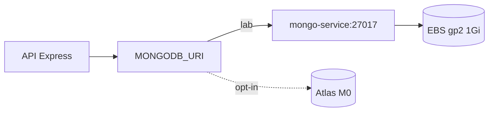

# RFC – MongoDB como persistência da oficina

**Casa:** escolha do engine e Atlas M0 **neste** repositório. Mongo in-cluster e ER do domínio: [TechChallenge-Fiap](https://github.com/RuannGodinho/TechChallenge-Fiap).

| Campo | Valor |
|---|---|
| **Número** | 002 |
| **Data** | 21/08/2026 |
| **Autor** | Ruann Correa Godinho |
| **Status** | Encerrada – Aprovada |
| **ADR** | [ADR-002](../adrs/002-mongodb-persistencia.md) |

## Resumo

Adotar **MongoDB** como banco da Node-Fiap, modelando a Ordem de Serviço como documento/agregado DDD. Em laboratório o Mongo roda **in-cluster** (PVC EBS no [TechChallenge-Fiap](https://github.com/RuannGodinho/TechChallenge-Fiap)); **MongoDB Atlas M0** entra só quando `enable_managed_db=true` (este repo).

## Problema

A oficina trata a Ordem de Serviço como o centro do atendimento: cliente, veículo, peças, serviços, status, orçamento e execução. Cada OS tem forma diferente — uma troca de óleo cabe em poucos campos; uma retífica aninha dezenas de itens.

Um modelo relacional rígido exigiria várias tabelas e JOINs na abertura da OS (`POST /api/ordensServico`), além de migrations a cada evolução do MVP (lote, garantia, número de série). O laboratório também precisa de um caminho barato: persistência que sobreviva a restart do pod, sem cluster de banco pago no Free Tier da AWS.

## Proposta técnica

Usar **MongoDB 8** com o banco `Node-Fiap`. A OS é um **agregado**: um documento com peças e serviços aninhados, recuperado em uma leitura na abertura — alinhado à Clean Architecture (gateways no Fiap, domínio sem driver).

```text
OrdemServico {
  cliente, veiculo,
  pecas[], servicos[],
  status, dataAbertura, ...
}
```

Coleções correlatas no mesmo banco: `Cliente`, `Veiculo`, `Peca`, `Servico`, `ExecucaoServico`, estoque e orçamentos.

**Dois estágios de operação** (não são dois bancos de domínio):

| Estágio | Onde | Quando |
|---|---|---|
| Padrão de laboratório | `mongo-deployment` + PVC no TechChallenge-Fiap | Cluster EKS sem flag de DB gerenciado |
| Gerenciado (opt-in) | MongoDB Atlas M0 — **este** repo | `enable_managed_db=true`; URI no SSM `/techchallenge/db/mongodb_uri` |

A API só conhece `MONGODB_URI`. Localmente o Compose sobe Mongo + API. No Kubernetes o seed é o Job `k8s/api-seed-job.yml` do Fiap.



## Impacto esperado

**Ganhos**

- Abertura de OS sem JOIN: um documento, um round-trip.
- Esquema flexível no MVP; novos campos na peça/OS não exigem migration bloqueante.
- Mesmo driver e mesma URI em Compose, EKS e Atlas — troca de staging sem reescrever casos de uso.
- Custo: in-cluster usa 1 Gi de EBS; Atlas M0 é gratuito (com limites de Atlas).

**Riscos e restrições**

- Consistência é por documento. Regras que cruzam estoque + OS exigem disciplina no caso de uso.
- Mongo in-cluster **não** é alta disponibilidade: um pod, um PVC.
- Atlas M0 tem limite de storage/CPU e IP access list; não é produção comercial.
- Modelagem documento demais pode duplicar dados de cliente/veículo se o time aninhar cópias sem política de referência.

**Operação**

- Backup in-cluster = snapshot EBS (manual neste recorte). Atlas traz backup do plano quando o cutover acontecer.
- Índices e queries da OS devem acompanhar o crescimento do array de peças/serviços.

## Alternativas consideradas

| Alternativa | Por que foi descartada |
|---|---|
| **PostgreSQL** (RDS ou no cluster) | Excelente para relatórios e integridade referencial. A OS, porém, é um agregado variável: o ganho de JOIN e migrations não justifica o custo de RDS neste MVP. |
| **Amazon DynamoDB** | Encaixa em AWS e escala, mas o modelo de acesso da oficina é rico. Dynamo exigiria GSIs cedo demais. |
| **MySQL / MariaDB** | Mesmo trade-off do PostgreSQL. |
| **Somente Atlas, desde o dia 1** | Evitaria Mongo no EKS, mas cria dependência de rede/IP allowlist e deste repositório antes da API subir. |
| **Somente arquivos / SQLite** | Inaceitável para API multi-réplica (HPA 1–4). |

## Justificativa formal e modelo

A discussão desta RFC escolhe o **engine**. O ER relacional, os ajustes 3NF → documento e as cardinalidades estão em [ARQUITETURA-MODELO-DADOS.md no Fiap](https://github.com/RuannGodinho/TechChallenge-Fiap/blob/main/docs/ARQUITETURA-MODELO-DADOS.md).

| Do relacional | Para o MongoDB |
|---|---|
| Tabelas-ponte OS–peça e OS–serviço | Arrays `pecas[]` e `servicos[]` no documento `OrdemServico` |
| `cliente_id` surrogate na OS | Chave natural `cpfCnpj` (= `Clientes.cpf`) |
| `VEICULO.cliente_id` | Removido; cliente e placa se encontram na OS |
| Tabelas de item de orçamento | Snapshot embutido em `Orcamento` |
| FK/CHECK no engine | Integridade nos casos de uso e value objects |

## Pontos em aberto

- Critério objetivo para ligar `enable_managed_db` (tamanho do PVC, backup automático, demo para banca).
- Índices da coleção `OrdemServico` para consulta pública por CPF/CNPJ.
- Estratégia de backup/restore do PVC enquanto o Atlas não estiver ativo.
